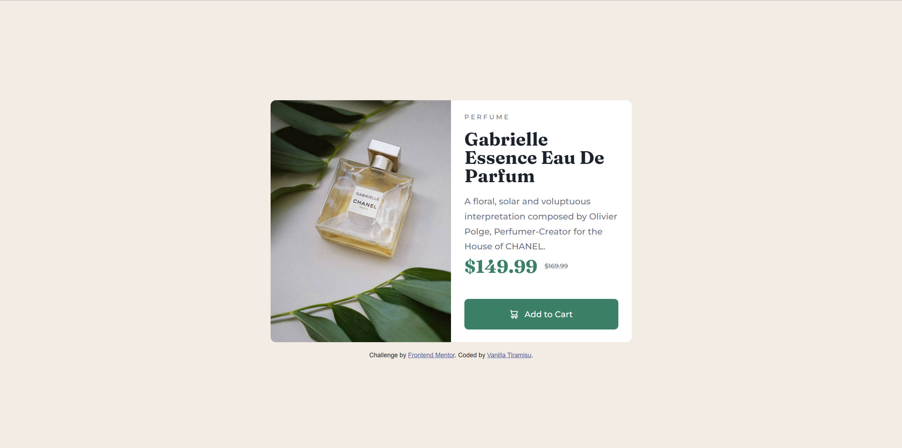

# Frontend Mentor - Product preview card component solution

This is a solution to the [Product preview card component challenge on Frontend Mentor](https://www.frontendmentor.io/challenges/product-preview-card-component-GO7UmttRfa). Frontend Mentor challenges help you improve your coding skills by building realistic projects. 

## Table of contents

- [Overview](#overview)
  - [The challenge](#the-challenge)
  - [Screenshot](#screenshot)
  - [Links](#links)
- [My process](#my-process)
  - [Built with](#built-with)
  - [What I learned](#what-i-learned)
  - [Continued development](#continued-development)
- [Author](#author)

**Note: Delete this note and update the table of contents based on what sections you keep.**

## Overview

### The challenge

Users should be able to:

- View the optimal layout depending on their device's screen size
- See hover and focus states for interactive elements

### Screenshot

### Links

- Solution URL: [GitHub Page](https://vanilla-tiramisu.github.io/product-preview-card-component-main/)

## My process

### Built with

- Semantic HTML5 markup
- CSS custom properties
- Flexbox
- Mobile-first workflow

### What I learned
1. I found that `display: block` doesn't really turn an inline block 
   into a 'block'. What it really means is that, line breaks would be 
   added both before and after the element; however, the element's width
   wouldn't be affected.
   As for the project, a button(as an inline block) cannot extend its 
   width like a common block element by simply declaring 'display: block.'
   Here I  replaced the `<button>` with a `
`. I don't know if there's 
   any better solution for this problem so far,and I would be very grateful
   if anyone's willing to give me some suggestions.
2. I've managed to use some skills and techniques I've learnt these days to 
   finish this project. It took me much more time than I've expected, and 
   forced me to understand what I've learnt deeper, so, the result's worth
   the time. Really happy to finish this challenge!

### Continued development

- BFC understanding
- BEM
- float
- Responsive design

### Useful resources
- CSS In Depth
- CSS: The Missing Manual, 4th
## Author

- Frontend Mentor - [@vanilla-tiramisu](https://www.frontendmentor.io/profile/vanilla-tiramisu)

